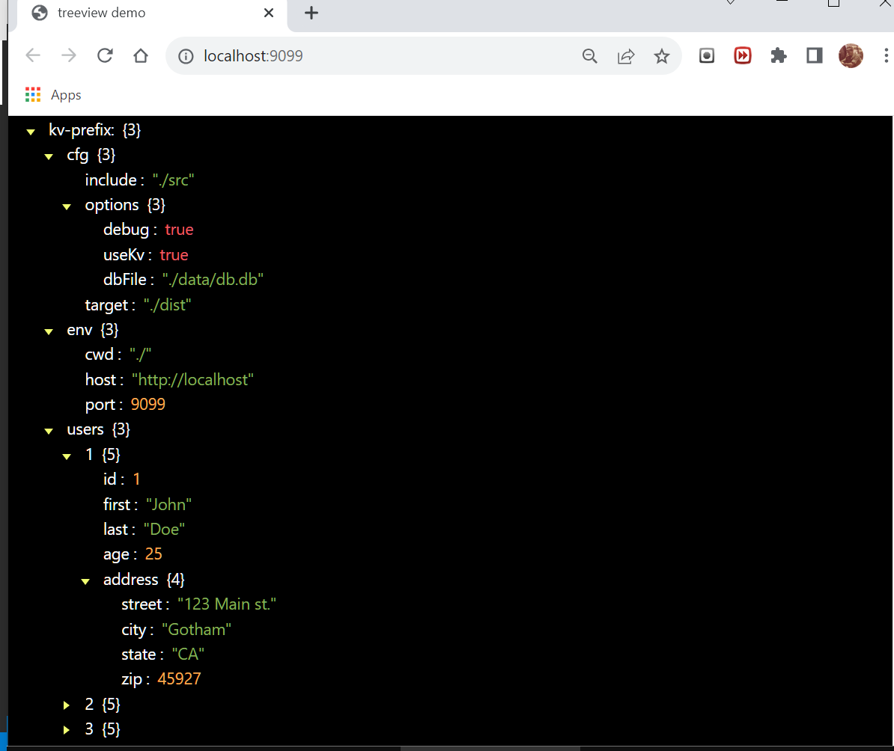

# Kv-TreeViewer
This is an example application for examining DenoKv data in a TreeView.   
This app uses a simple RPC service to fetch and prep all DenoKv-db-rows    
for viewing in a DOM Treeview.  

## Note: 
This is an unfinished work that was testing the concept of showing multipart-keys in a tree format.  Many features are yet to be implemented. This work has now been rolled into another db project that has the ability to use many different peristence layers. (BuenoKV)    

## About
This simple client demonstrates a minimal asynchronous-transaction-based SSE-KV-RPC service.    
It's using Server-Sent-Events to execute Remote-Procedure-Calls to a remote Deno-kvDB.    
See: _./dbClient.js/_ in this repo.   

## try it: 
https://nhrones.github.io/KvTreeClient/   

This example connects to an SSE-KV-RPC service located on Deno Deploy.    
See service repo: https://github.com/nhrones/KvTreeService 

