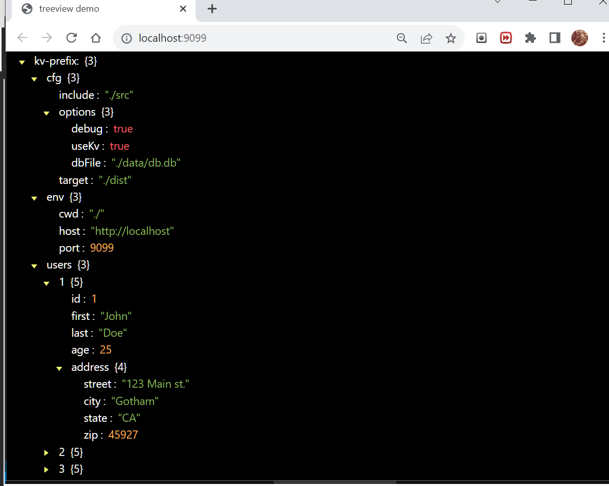
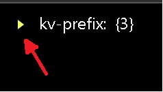

# Kv-TreeViewer
This is an example application for examining DenoKv data in a TreeView.   
This app uses a simple RPC service to fetch all DenoKv-rows from a remote service    
for viewing in a custom DOM Treeview.  

## Note: 
This is an unfinished work testing the concept of showing multipart-keys in a tree format.    
Many features are yet to be implemented.   

This work has now been rolled into another db project that has the ability to use many different peristence layers. (BuenoKV)    

## About
This simple client demonstrates a minimal asynchronous-transaction based SSE-KV-RPC service.    
It's using Server-Sent-Events to execute Remote-Procedure-Call transactions to a remote Deno-kvDB.    
See: _./remoteKv.js/_ in this repo.   

   
On start, please click the root-node to begin to traverse the tree.
## Try it: https://nhrones.github.io/KvTreeClient/   

## The service:
This example connects to an SSE-KV-RPC service located on Deno Deploy.    
See service repo: https://github.com/nhrones/KvTreeService 